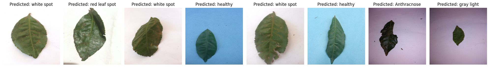

# Tea Leaves Disease Detection

A deep learning project for identifying diseases in tea leaves using transfer learning with EfficientNetV2B3 and ResNet50V2 architectures.



## 🎯 Objective

This project aims to automatically classify tea leaf diseases using computer vision and deep learning techniques to help farmers identify plant health issues early.

## 📊 Dataset

!Kaggle tea leaves defect dataset - https://www.kaggle.com/datasets/shashwatwork/identifying-disease-in-tea-leafs

The dataset contains 8 classes of tea leaf conditions:

- **Anthracnose** - Fungal disease causing dark lesions
- **Algal leaf** - Algal infection on leaves
- **Bird eye spot** - Characteristic spotted pattern
- **Brown blight** - Browning and withering of leaves
- **Gray light** - Grayish discoloration
- **Healthy** - Normal healthy leaves
- **Red leaf spot** - Reddish spot formations
- **White spot** - White spot disease

**Dataset Specifications:**
- Image size: 1024 x 768
- Training/Validation split: 80%/20%
- Batch size: 32
- Color mode: RGB

## 🧠 Models Implemented

### 1. EfficientNetV2B3
- **Base Model**: EfficientNetV2B3 (ImageNet weights)
- **Transfer Learning**: Frozen base layers
- **Custom Layers**:
  - Flatten layer
  - Dense layer (512 units, ReLU activation)
  - Output layer (8 units, Softmax activation)

### 2. ResNet50V2
- **Base Model**: ResNet50V2 (ImageNet weights)
- **Transfer Learning**: Frozen base layers
- **Custom Layers**:
  - Flatten layer
  - Dense layer (512 units, ReLU activation)
  - Output layer (8 units, Softmax activation)


## 📈 Performance Results

### Model Performance Metrics

| Model              | F1-Score (Micro) | Validation Accuracy |
|--------------------|------------------|---------------------|
| EfficientNetV2B3   | 0.8531           | 88%                 |
| ResNet50V2         | 0.7966           | 79.6%               |

### Confusion Matrix

Both models generate detailed confusion matrices showing classification performance across all 8 classes, providing insights into specific class-wise performance and common misclassifications.

## 🚀 Usage

1. **Data Preparation**: Organize images in the directory structure as shown in the notebook
2. **Training**: Run the Jupyter notebook cells sequentially to train both models
3. **Evaluation**: The notebook includes code for:
   - Model training and validation
   - Confusion matrix visualization
   - F1-score calculation
   - Sample predictions visualization

### Scripts (`src/`)

```bash
pip install -r requirements.txt

# Download the Kaggle dataset and link it to data/tea-leaves
python -m src.download_data

# Train + evaluate. Checkpoints: outputs/<model>/checkpoints/{best,last}.keras
python -m src.train --model efficientnet
python -m src.train --model resnet --head gap --augment
python -m src.train --model vit --augment       # pretrained ViT-B/16 from the HF Hub
python -m src.train --model efficientnet --resume   # continue an interrupted run

# Re-evaluate a saved run, or predict on new images
python -m src.evaluate --run-dir outputs/efficientnet
python -m src.predict --run-dir outputs/efficientnet Test_images/01.jpeg Test_images/02.jpg
```

| File | Purpose |
|------|---------|
| `src/config.py` | Dataclass configs (data, training, CNN head, ViT preset/hyperparameters) |
| `src/download_data.py` | Kaggle dataset download via `kagglehub` |
| `src/data.py` | Dataset loading and augmentation |
| `src/models/cnn.py` | EfficientNetV2B3 / ResNet50V2 transfer-learning models |
| `src/models/vit.py` | Pretrained ViT (KerasHub preset from the Hugging Face Hub) + classification head |
| `src/train.py`, `src/evaluate.py`, `src/predict.py` | CLI entry points |

## 🛠️ Technical Requirements

- Python 3.7+
- TensorFlow 2.0+
- OpenCV
- scikit-learn
- pandas, numpy
- matplotlib, seaborn

## 📋 Key Features

- **Transfer Learning**: Leverages pre-trained models for better performance
- **Data Augmentation**: Built-in TensorFlow image preprocessing
- **Visualization**: Confusion matrices and sample predictions
- **Early Stopping**: Prevents overfitting during training
- **Learning Rate Scheduling**: Adaptive learning rate adjustment

## 🎨 Sample Predictions

The notebook includes visualization of test images with predicted labels, allowing for qualitative assessment of model performance across different disease types.

## 🔮 Future Improvements

- Experiment with different image sizes
- Try additional data augmentation techniques
- Implement ensemble methods
- Develop a web/mobile application for real-world usage
- Expand dataset with more samples per class

## 📝 License

This project is intended for educational and research purposes. Please ensure proper attribution if using the code or methodology.

## 🤝 Contributing

Contributions, issues, and feature requests are welcome! Feel free to check issues page.
