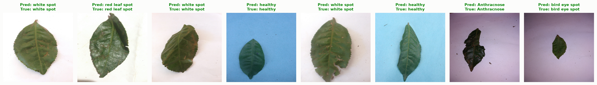
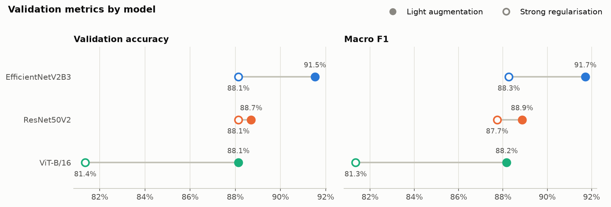
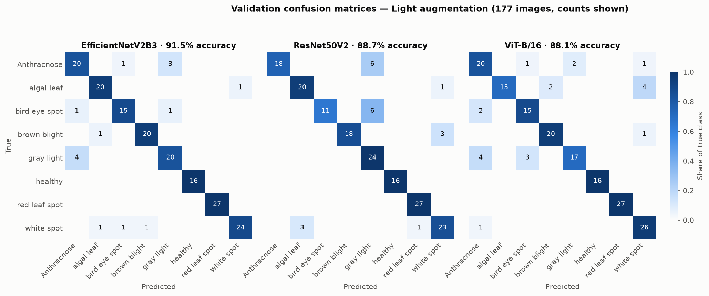
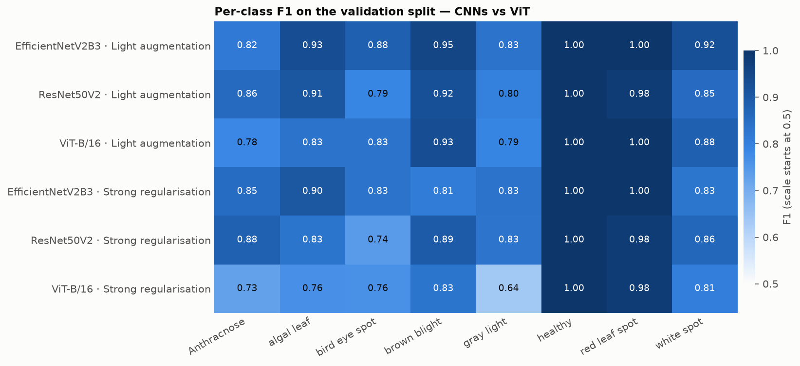
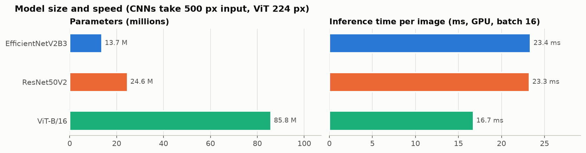
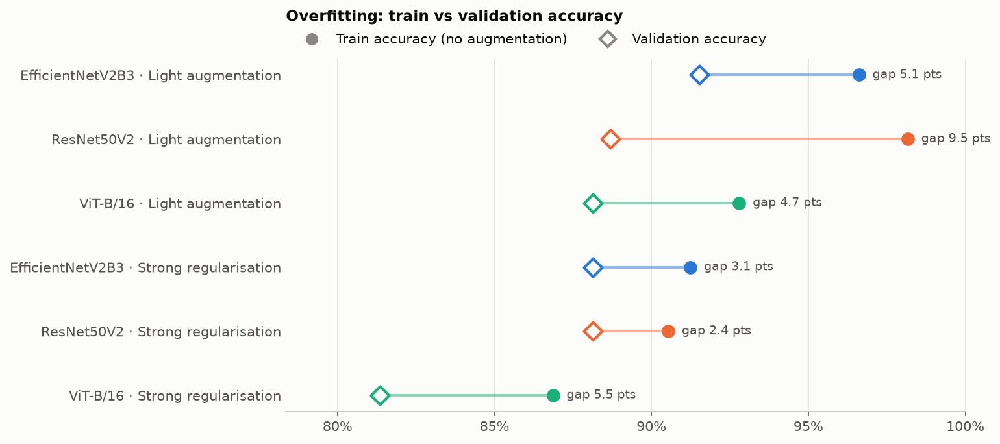
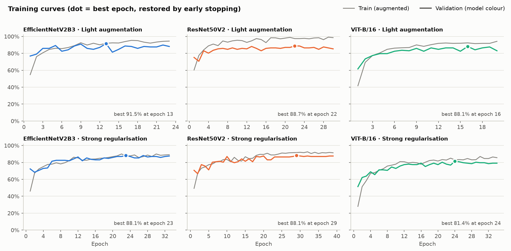

# Tea Leaf Disease Detection: CNNs vs Vision Transformer

Classifying 8 tea-leaf conditions with transfer learning, comparing two CNNs
(EfficientNetV2B3, ResNet50V2) with a Vision Transformer (ViT-B/16).


*Best model (EfficientNetV2B3) on validation images: predicted vs true label.*

## Results at a glance

| Model | Val accuracy | Macro F1 | Params | Inference |
|---|---|---|---|---|
| **EfficientNetV2B3** | **91.5%** | **0.917** | 13.7 M | 23.4 ms/img |
| ResNet50V2 | 88.7% | 0.889 | 24.6 M | 23.3 ms/img |
| ViT-B/16 (frozen backbone) | 88.1% | 0.882 | 85.8 M | 16.7 ms/img |

Best run per model, validation split of 177 images. Inference measured on an
RTX 2050 (4 GB), batch 16; the CNNs take 500 px inputs, the ViT 224 px.

- **EfficientNetV2B3 is the best model**: highest accuracy with the fewest parameters.
- **The frozen ViT matches ResNet50V2** while training only its 6K-parameter head,
  but needs 3.5x ResNet's parameters.
- **Stronger regularisation reduced overfitting but cost accuracy** (see [below](#regularisation-experiment)).
- One validation image is worth 0.56%, so gaps under ~2 points are within noise.

## Dataset

[Identifying Disease in Tea Leaves](https://www.kaggle.com/datasets/shashwatwork/identifying-disease-in-tea-leafs)
(Kaggle): 885 RGB images (1024 x 768) in 8 classes, split 80/20 with a fixed
seed into 708 training and 177 validation images.

| Class | Description |
|---|---|
| Anthracnose | Fungal disease causing dark lesions |
| Algal leaf | Algal infection on leaves |
| Bird eye spot | Characteristic spotted pattern |
| Brown blight | Browning and withering of leaves |
| Gray light | Grayish discoloration |
| Healthy | Normal healthy leaves |
| Red leaf spot | Reddish spot formations |
| White spot | White spot disease |

## Models

All three use ImageNet-pretrained backbones kept frozen; only the head is trained.

| | EfficientNetV2B3 | ResNet50V2 | ViT-B/16 |
|---|---|---|---|
| Backbone | `keras.applications` | `keras.applications` | KerasHub preset `vit_base_patch16_224_imagenet` from the Hugging Face Hub |
| Input | 500 x 500, raw pixels (built-in scaling) | 500 x 500, scaled to [-1, 1] | 224 x 224, scaled to [-1, 1] |
| Head | GlobalAveragePooling → Dense(512) → Dense(8) | GlobalAveragePooling → Dense(512) → Dense(8) | [CLS] token → Dropout → Dense(8) |
| Optimiser | Adam 1e-3 | Adam 1e-3 | AdamW 1e-3 |

Training uses early stopping on validation accuracy (patience 10, best weights
restored) and learning-rate reduction on plateau.

## Detailed results

### Validation metrics



| Experiment | Model | Val accuracy | Macro F1 | Train accuracy* | Gap (pts) |
|---|---|---|---|---|---|
| Light augmentation | EfficientNetV2B3 | **91.5%** | **0.917** | 96.6% | 5.1 |
| Light augmentation | ResNet50V2 | 88.7% | 0.889 | 98.2% | 9.5 |
| Light augmentation | ViT-B/16 | 88.1% | 0.882 | 92.8% | 4.7 |
| Strong regularisation | EfficientNetV2B3 | 88.1% | 0.883 | 91.2% | 3.1 |
| Strong regularisation | ResNet50V2 | 88.1% | 0.877 | 90.5% | 2.4 |
| Strong regularisation | ViT-B/16 | 81.4% | 0.813 | 86.9% | 5.5 |

\* Re-evaluated on the training split **without augmentation**. The training
accuracy Keras logs during `fit` has augmentation and dropout switched on, so it
understates how well the model fits the training data.

For reference, the original notebook reached 88% (EfficientNetV2B3) and 79.6%
(ResNet50V2) with a Flatten head. ResNet50V2's large gain most likely comes from
adding its missing [-1, 1] input scaling and switching to a pooled head.

### Confusion matrices



- **Healthy and red leaf spot are classified perfectly by every model.**
- **Anthracnose ↔ gray light** is the most common mix-up for all three models.
- **ResNet50V2** additionally confuses bird eye spot with gray light (6 of 17).
- **ViT-B/16** mistakes algal leaf for white spot (4 of 21).

Confusion matrices for the regularised runs:
[`Images/confusion_matrices_strong_regularisation.png`](Images/confusion_matrices_strong_regularisation.png).

### Per-class F1: CNNs vs ViT



The ViT trails the CNNs most on anthracnose and algal leaf. These are classes
defined by small lesions; a plausible cause is that the CNNs' 500 px input keeps
more lesion detail than the ViT's 224 px.

### Model size and speed



The ViT has 6x EfficientNet's parameters, yet it is the fastest here because it
processes far fewer pixels (224 px vs 500 px).

### Regularisation experiment

The first runs overfit, ResNet50V2 most of all (98% train vs 89% validation).
A second round added all of the following at once:

- full-rotation and vertical-flip augmentation, translation and brightness
- head dropout 0.4 (CNNs) / 0.3 (ViT)
- label smoothing 0.1
- AdamW weight decay 0.01



- **The CNN train/validation gap shrank**: ResNet50V2 from 9.5 to 2.4 points,
  EfficientNetV2B3 from 5.1 to 3.1.
- **Validation accuracy did not improve**. It fell 3.4 points for EfficientNet
  and 6.7 for the ViT, so the combined regularisation was too strong.
- **The frozen ViT gained nothing.** With only 6K trainable parameters it barely
  overfits, so regularisation just made it underfit.



## Usage

```bash
pip install -r requirements.txt
python -m src.download_data   # Kaggle dataset -> data/tea-leaves (via kagglehub)
```

Reproduce the light-augmentation runs:

```bash
python -m src.train --model efficientnet --head gap --augment
python -m src.train --model resnet --head gap --augment --batch-size 16
python -m src.train --model vit --augment --freeze-backbone --batch-size 16 --learning-rate 1e-3
```

Reproduce the strong-regularisation runs:

```bash
COMMON="--augment strong --label-smoothing 0.1 --weight-decay 0.01 --output-dir outputs/regularized"
python -m src.train --model efficientnet --head gap --dropout 0.4 --epochs 50 $COMMON
python -m src.train --model resnet --head gap --dropout 0.4 --epochs 50 --batch-size 16 $COMMON
python -m src.train --model vit --freeze-backbone --learning-rate 1e-3 --dropout 0.3 --epochs 40 --batch-size 16 $COMMON
```

Evaluate and predict:

```bash
python -m src.evaluate --run-dir outputs/efficientnet
python -m src.predict --run-dir outputs/efficientnet Test_images/01.jpeg Test_images/02.jpg
```

Each run writes to `outputs/<model>/`:

- `checkpoints/best.keras` and `checkpoints/last.keras`; resume an interrupted run with `--resume`
- `model.keras`
- `history.csv`, `metrics.json`, `run_config.json`
- confusion-matrix and sample-prediction plots

Run `python -m src.train --help` for all options.

### GPU notes (TensorFlow 2.21 pip install)

- **No GPU detected?** Check for `Cannot dlopen some GPU libraries`. TF 2.21's
  wheel does not search `site-packages/nvidia/cusolver/lib`; add that folder to
  `LD_LIBRARY_PATH`.
- **Only about half the GPU memory used?** TF's default allocator capped a 4 GB
  card at ~2.1 GB. Set `TF_GPU_ALLOCATOR=cuda_malloc_async` to use the full card.

## Project structure

```
src/
├── config.py          dataclass configs (data, training, CNN head, ViT preset)
├── data.py            dataset loading, light/strong augmentation
├── download_data.py   Kaggle download via kagglehub
├── models/
│   ├── cnn.py         EfficientNetV2B3 / ResNet50V2 builders
│   └── vit.py         pretrained ViT-B/16 (KerasHub, Hugging Face Hub)
├── train.py           training CLI with checkpoints and resume
├── evaluate.py        metrics, confusion matrix, sample predictions for one run
├── predict.py         inference on new images
└── visualize.py       plotting helpers
Images/                result figures and the numbers behind them (results.json)
Test_images/           example images for predict.py
```

## Limitations and future work

- **Single small validation split.** No separate test set, and the same split
  picks the best epoch, so scores are optimistic. Stratified k-fold or a
  held-out test set would give tighter estimates.
- **Possible background shortcut.** Some classes were photographed on
  distinctive backgrounds (e.g. healthy leaves on blue). The perfect scores on
  healthy and red leaf spot may partly reflect this. Grad-CAM or
  background-normalised test images would show it.
- **Untried improvements:**
  - fine-tuning the top backbone blocks with a low learning rate
  - full ViT fine-tuning (needs mixed precision on a 4 GB GPU)
  - tuning each regulariser separately instead of all at once
  - an ensemble of EfficientNet and ViT

## License

[MIT](LICENSE)
